[](https://github.com/alanmgg/Proyecto-Computacion-Grafica)
[](https://github.com/alanmgg)
[](https://github.com/alanmgg/Proyecto-Computacion-Grafica/commits/main)
[](https://github.com/alanmgg)
[](https://github.com/alanmgg)

# PROYECTO FINAL 2022-2
Proyecto final para la clase de Computación Gráfica. FI, UNAM. Semestre 2022-2

#### Objetivo:
```
  El alumno deberá aplicar y demostrar los conocimientos adquiridos durante todo el curso.
```

#### Descripción:
```
  El alumno deberá seleccionar una fachada y un espacio que pueden ser realeso ficticios y presentar 
  imágenes de referencia de dichos espacios para surecreación 3D en OpenGL.
  En la imagen de referencia se debe visualizar 7 objetos que el alumno va a recrear virtualmente y 
  donde dichos objetos deben ser lo más parecido a su imagen de referencia, así como su ambientación.
  Se debe subir un documento pdf donde muestre claramente su fachada y el cuarto a recrear, así como 
  también un listado de los 7 objetos que se van a desarrollar dentro de dicho.
```

#### Elementos a implementar:
- [x] Manual técnico y de usuario.
- [x] Proyecto en repositorio con cambios hechos durante el semestre.
- [x] Realismo del espacio virtual contra la foto de referencia.
- [x] Archivo Ejecutable.
- [x] Modelado (mínimo 7 elementos).
- [x] Animaciones sencillas (mínimo 3).
- [x] Animaciones complejas (mínimo 2).
- [x] Manejo de cámara.

#### Modelos a diseñar:
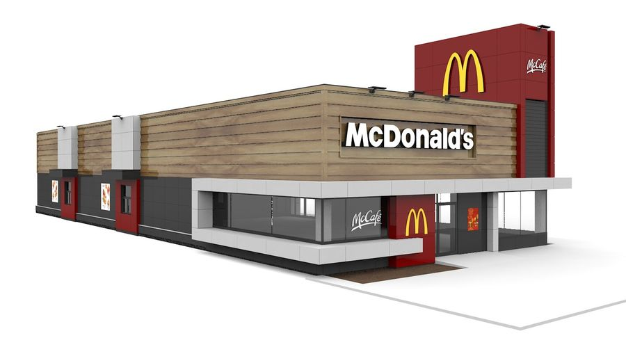
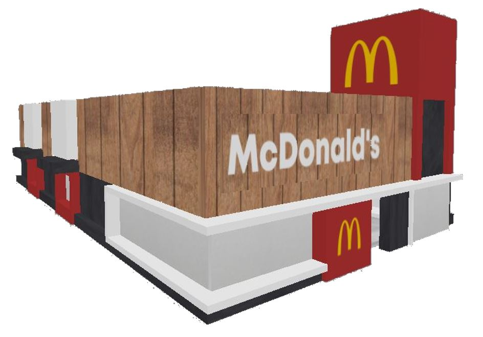
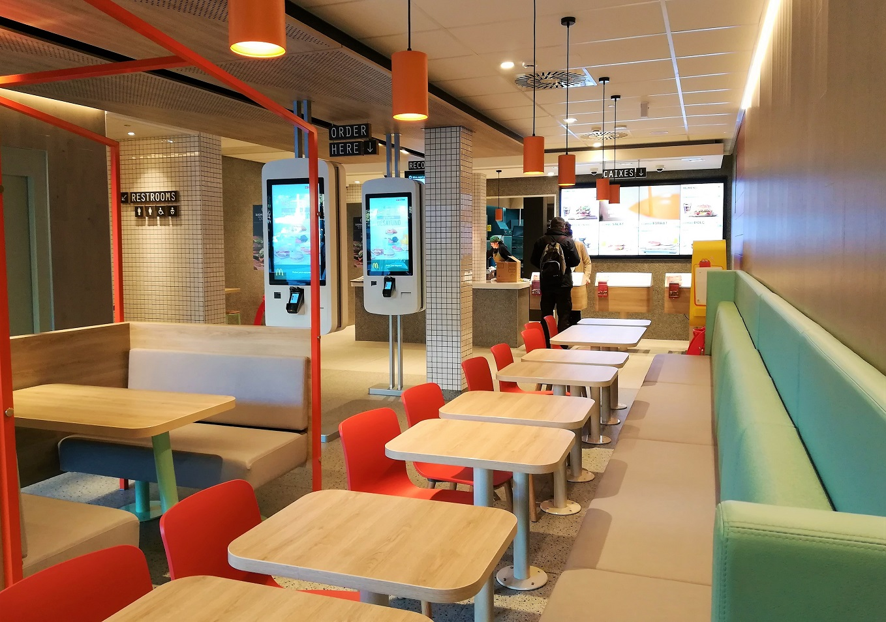
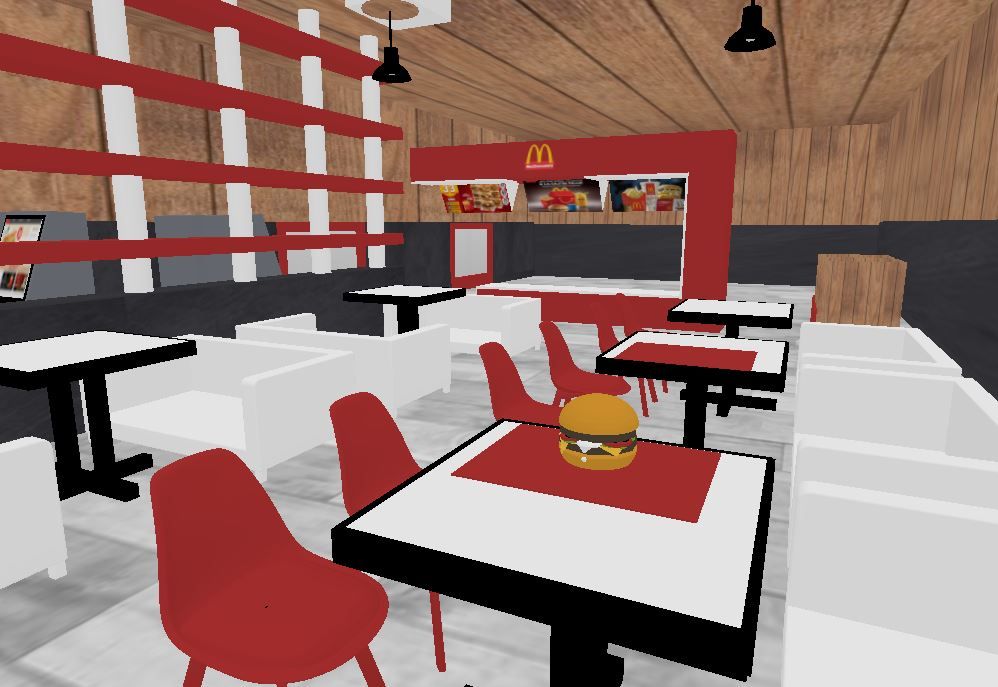
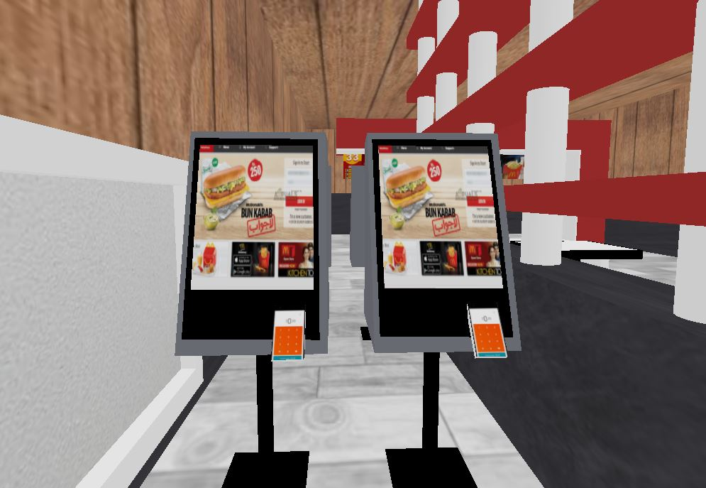
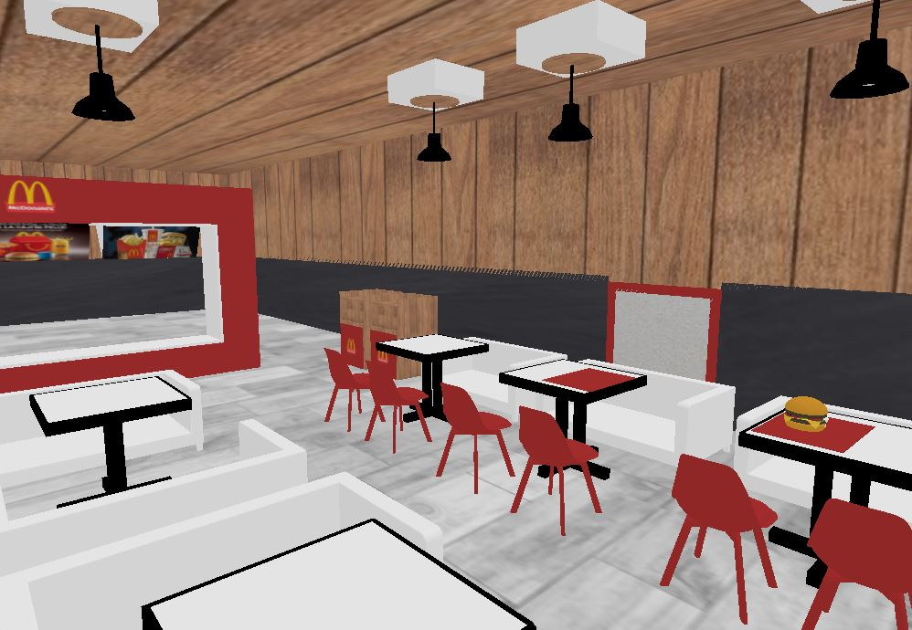
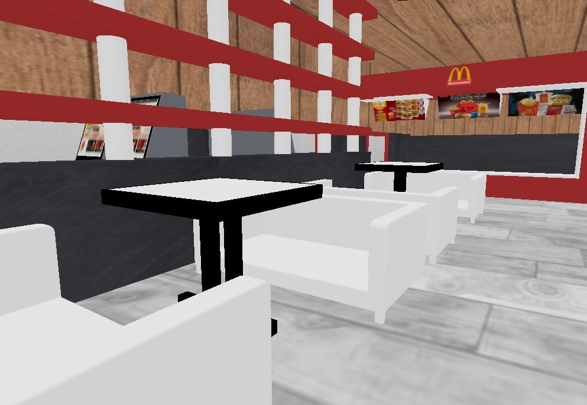
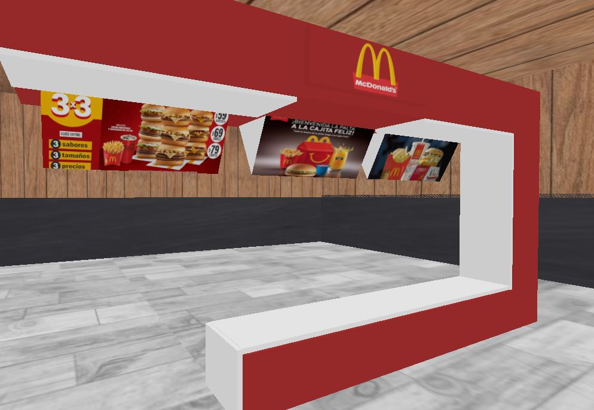
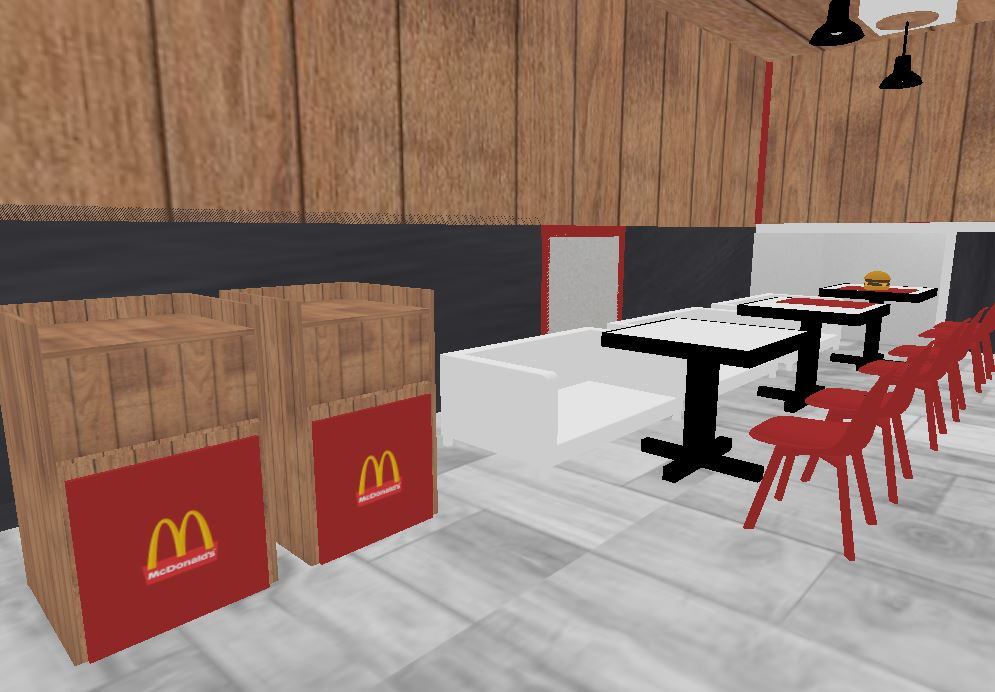
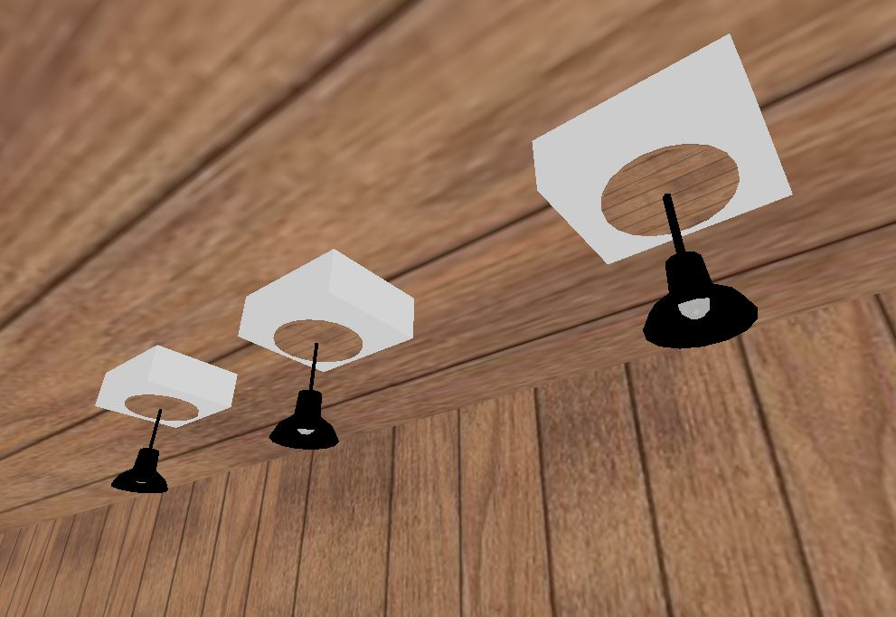
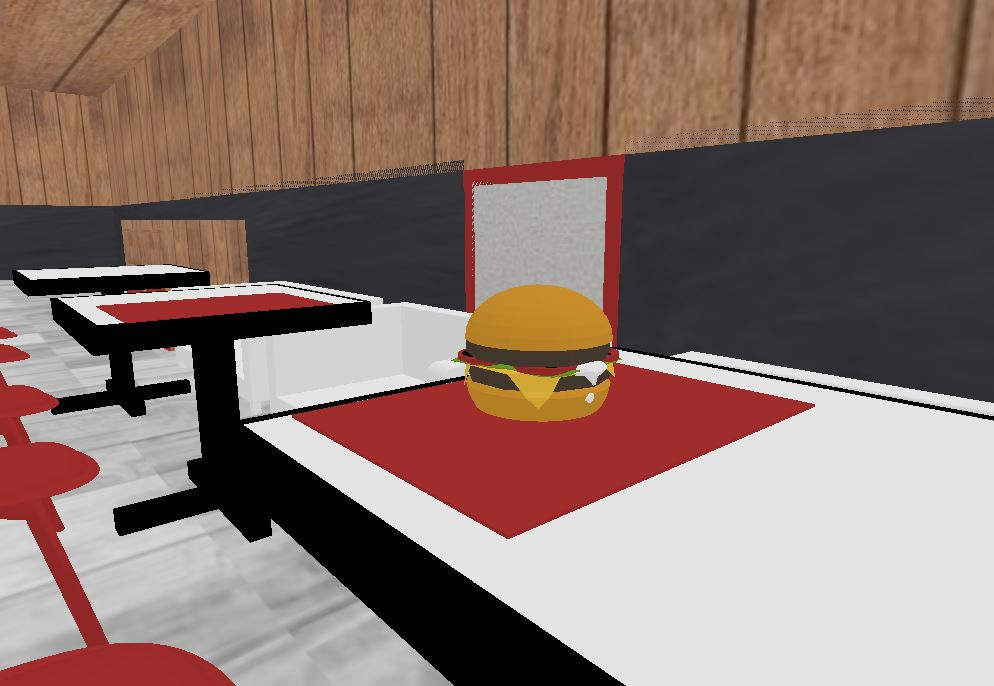
